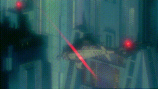

# peek
( ͡° ͜ʖ ͡°)	

Playing around with [detr-resnet-101](https://huggingface.co/facebook/detr-resnet-101) and [segment-anything](https://github.com/facebookresearch/segment-anything), FastAPI, FFmpeg, and SQLite. Not really meant for anyone else to use (you obviously can't run this, unless you also have the same movie files inside of `peek/app/movie_files/`).

1. `uvicorn app.main:app --reload`
2. `curl http://localhost:8000/movies/1/screenshot | tee >(jq -r '.screenshot' | base64 --decode > peek_output1.jpg) >(jq '.detr_output') > /dev/null`
3. enjoy the screenshot. print it out. frame it.

### Get List of Movies

- **Endpoint**: `GET /movies`
- **Description**: Retrieves a list of all movies in the database, including their IDs, titles, release years, and directors.

```json
[
    {"id":1,"title":"Blood Sport","year":1988,"director":"Newt Arnold"},
    {"id":2,"title":"Boiling Point","year":1990,"director":"Takeshi Kitano"},
    {"id":3,"title":"Ghost in the Shell","year":1995,"director":"Mamoru Oshii"}
]
```

### Get Movie Screenshot

- **Endpoint**: `GET /movies/{movie_id}/screenshot`
- **Description**: Retrieves a random screenshot from the movie specified by the given movie_id. Performs object detection on the screenshot and returns details of detected objects.
- **Param**: 
    - `movie_id`
- **Returns**: A JSON object containing:
    - screenshot: `base64`` encoded string of the screenshot
    - detr_output: An array of objects representing detected items in the screenshot. Each object includes the label, confidence score, and bounding box coordinates.

```json
{
  "screenshot": "base64_image_data...",
  "detr_output": [
    {
      "label": "person",
      "confidence": 0.98,
      "box": [163.98, 97.83, 550.38, 581.16]
    },
    // ... more detected objects ...
  ]
}
```


### Get Movie GIF

- **Endpoint**: `GET /movies/{movie_id}/gif`
- **Description**: Generates and retrieves a random 10-second GIF from the movie specified by the given `movie_id`.
- **Param**: 
    - `movie_id`
- **Returns**: JSON object containing a `base64` encoded GIF

```json
{
  "data": "base64_gif_data..."
}
```

