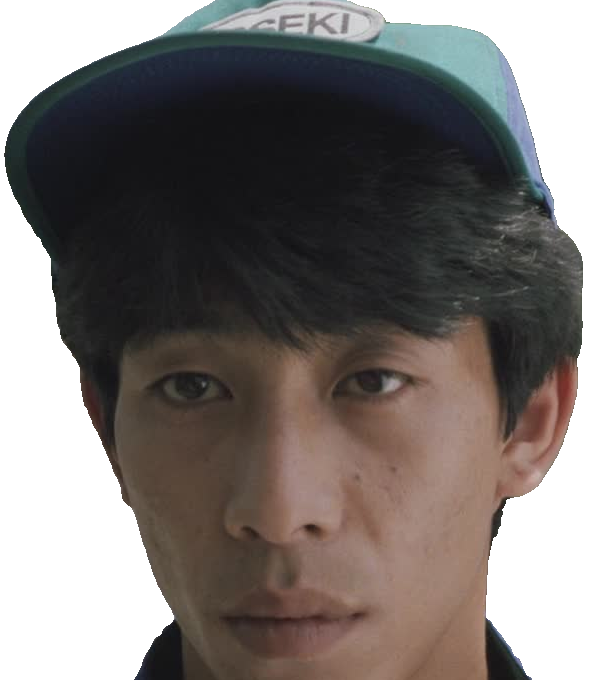

# peek
( ͡° ͜ʖ ͡°)	

Playing around with [segment-anything](https://github.com/facebookresearch/segment-anything), [detr-resnet-101](https://huggingface.co/facebook/detr-resnet-101), and FastAPI. Upload an image and detr-resnet-101 identifies objects, returning confidence scores and bounding box data. For the object with the highest confidence score, segment-anything takes the bounding box data and segments the object from the overall image.

You'll need a [model checkpoint](https://github.com/facebookresearch/segment-anything#model-checkpoints) placed in the root dir.

This example uses a [forked version of segment-anything](https://github.com/0v00/segment-anything) (with a single, minor change) to get this working with MPS.

1. create a `venv`
2. `pip install -r requirements.txt`
3. `uvicorn app.main:app --reload`
4. make a POST request:
```bash
curl -X POST "http://localhost:8000/segment/extract_obj_with_label" \
     -H "accept: application/json" \
     -H "Content-Type: multipart/form-data" \
     -F "file=@path/to/image;type=image/png" \
     -F "label=person" \
     | tee >(jq -r '.extracted_obj' | base64 --decode > extracted_obj.png) \
     | jq '.detr_output'
```
3. enjoy the image. print it out. frame it.

## Extract Object with Label

- **Endpoint**: `POST /segment/extract_obj_with_label`
- **Description**: Accepts an image and label. Performs object detection and segmentation to isolate the object from the background. The segmented object is cropped and rendered with transparency in `PNG` format.
- **Returns**: A JSON object containing:
    - extracted_obj: `base64` encoded string of the `PNG` with the extracted object
    - detr_output: An array of objects representing detected items in the screenshot. Each object includes the label, confidence score, and bounding box coordinates.

### example usage

```bash
curl -X POST "http://localhost:8000/segment/extract_obj_with_label" \
     -H "accept: application/json" \
     -H "Content-Type: multipart/form-data" \
     -F "file=@path/to/image;type=image/png" \
     -F "label=person" \
     | tee >(jq -r '.extracted_obj' | base64 --decode > extracted_obj.png) \
     | jq '.detr_output'
```

### example json

```json
{
  "extracted_obj": "base64_image_data...",
  "detr_output": [
    {
      "label": "person",
      "confidence": 0.98,
      "box": [163.98, 97.83, 550.38, 581.16]
    },
    // ... more detected objects ...
  ]
}
```

### examples of extracted objects





### Overlay Mask

- **Endpoint**: `POST /segment/overlay_mask`
- **Description**: Accepts an image. Performs object detection and segmentation. Overlays detected object with a semi-transparent mask.
- **Returns**: A JSON object containing:
    - image_with_mask: `base64` encoded string of the image with mask
    - detr_output: An array of objects representing detected items in the image. Each object includes the label, confidence score, and bounding box coordinates.

### example usage

```bash
curl -X POST "http://localhost:8000/segment/overlay_mask" \
     -H "accept: application/json" \
     -H "Content-Type: multipart/form-data" \
     -F "file=@path/to/image;type=image/png" \
     -F "label=person" \
     | tee >(jq -r '.image_with_mask' | base64 --decode > image_with_mask.png) \
     | jq '.detr_output'
```

### example json

```json
{
  "image_with_mask": "base64_image_data...",
  "detr_output": [
    {
      "label": "person",
      "confidence": 0.98,
      "box": [163.98, 97.83, 550.38, 581.16]
    },
    // ... more detected objects ...
  ]
}
```
### example of image with mask


_*Boiling Point (1990) - Takeshi Kitano*_

## tests
Run `pytest` or `pytest -n <amount_of_workers>`, the latter command will spawn a number of worker processes equal to the number of available CPUs, and then distribute the tests randomly across them.