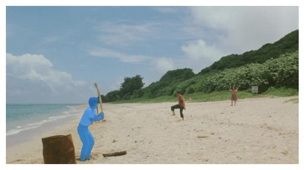
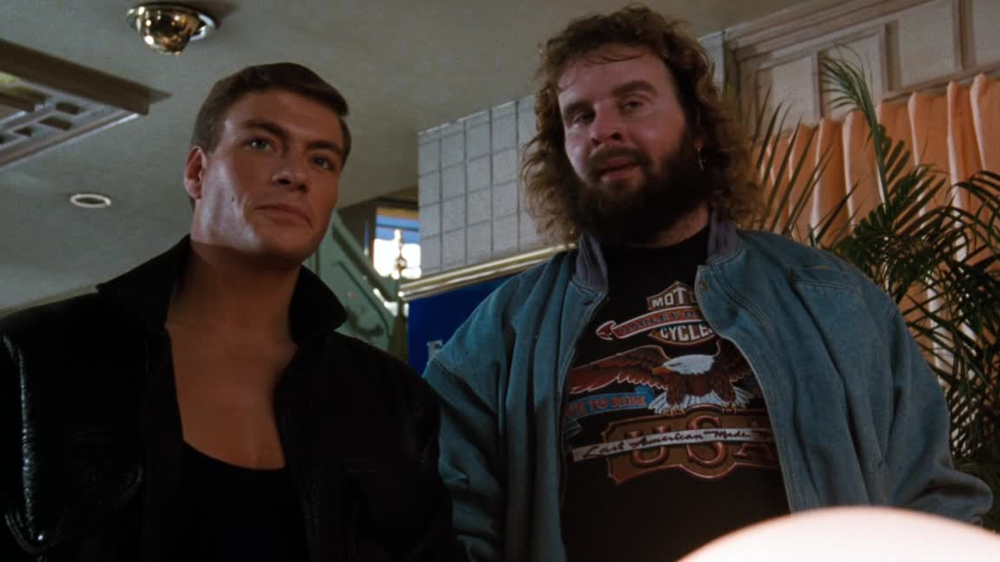

# peek
( ͡° ͜ʖ ͡°)	

Playing around with [segment-anything](https://github.com/facebookresearch/segment-anything), [detr-resnet-101](https://huggingface.co/facebook/detr-resnet-101), FastAPI, and FFmpeg. Text to object segmentation (although currently I only look for objects labeled `person`), and then return a semi-transparent mask overlaid on an image, or return an extracted object with a transparent background.

You'll need ffmpeg installed, and a [model checkpoint](https://github.com/facebookresearch/segment-anything#model-checkpoints) placed in the root dir.

This example uses a [forked version of segment-anything](https://github.com/0v00/segment-anything) (with a single, minor change) to get this working with MPS.

1. create a `venv`
2. `pip install -r requirements.txt`
3. `uvicorn app.main:app --reload`
4. make a POST request:
```bash
curl -X POST "http://localhost:8000/segment/upload/extract_obj_from_video" \
     -H "accept: application/json" \
     -H "Content-Type: multipart/form-data" \
     -F "file=@path/to/some/video" \
     | jq -r '.screenshot + " " + .extracted_obj' \
     | (read screenshot extracted_obj; echo $screenshot | base64 --decode > screenshot.jpg; echo $extracted_obj | base64 --decode > extracted_obj.png)
```
3. enjoy the screenshot. print it out. frame it.

### Extract Object from Video

- **Endpoint**: `POST /segment/upload/extract_obj_from_video`
- **Description**: Accepts a video and extracts a frame at random. Performs object detection and segmentation to isolate the object from the background. The segmented object is cropped and rendered with transparency in `PNG` format.
- **Returns**: A JSON object containing:
    - screenshot: `base64` encoded string of the original frame
    - extracted_obj: `base64` encoded string of the `PNG` with the extracted object
    - detr_output: An array of objects representing detected items in the screenshot. Each object includes the label, confidence score, and bounding box coordinates.

```json
{
  "screenshot": "base64_image_data...",
  "extracted_obj": "base64_image_data...",
  "detr_output": [
    {
      "label": "person",
      "confidence": 0.98,
      "box": [163.98, 97.83, 550.38, 581.16]
    },
    // ... more detected objects ...
  ]
}
```


_*Boiling Point (1990) - Takeshi Kitano*_

### Extract Object with Label

- **Endpoint**: `POST /segment/upload/extract_obj_with_label`
- **Description**: Accepts an image and label. Performs object detection and segmentation to isolate the object from the background. The segmented object is cropped and rendered with transparency in `PNG` format.
- **Returns**: A JSON object containing:
    - extracted_obj: `base64` encoded string of the `PNG` with the extracted object
    - detr_output: An array of objects representing detected items in the screenshot. Each object includes the label, confidence score, and bounding box coordinates.

```bash
curl -X POST "http://localhost:8000/segment/upload/extract_obj_with_label" \
     -H "accept: application/json" \
     -H "Content-Type: multipart/form-data" \
     -F "file=@path/to/image;type=image/png" \
     -F "label=person" \
     | tee >(jq -r '.extracted_obj' | base64 --decode > extracted_obj.png) \
     | jq '.detr_output'
```

```json
{
  "extracted_obj": "base64_image_data...",
  "detr_output": [
    {
      "label": "person",
      "confidence": 0.98,
      "box": [163.98, 97.83, 550.38, 581.16]
    },
    // ... more detected objects ...
  ]
}
```


### Single Prediction

- **Endpoint**: `POST /segment/upload/single_prediction`
- **Description**: Accepts a video and extracts a frame at random. Performs object detection and segmentation. This should only take a few seconds using MPS.
- **Returns**: A JSON object containing:
    - screenshot: `base64` encoded string of the original frame
    - prediction: `base64` encoded string of the frame with the segmented object overlaid with a semi-transparent mask
    - detr_output: An array of objects representing detected items in the screenshot. Each object includes the label, confidence score, and bounding box coordinates.

```json
{
  "screenshot": "base64_image_data...",
  "prediction": "base64_image_data...",
  "detr_output": [
    {
      "label": "person",
      "confidence": 0.98,
      "box": [163.98, 97.83, 550.38, 581.16]
    },
    // ... more detected objects ...
  ]
}
```




_*Boiling Point (1990) - Takeshi Kitano*_