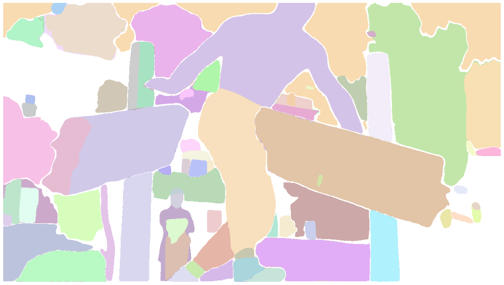
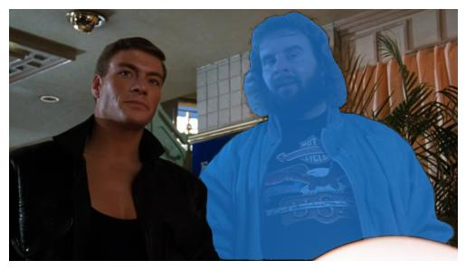

# peek
( ͡° ͜ʖ ͡°)	

Playing around with [detr-resnet-101](https://huggingface.co/facebook/detr-resnet-101), [segment-anything](https://github.com/facebookresearch/segment-anything), FastAPI, FFmpeg, and SQLite. If you want to use it, create a `movie_files` dir inside of `app` with some movies/video. Update `init_db.py` with the correct movie details. Or alternatively, just ignore the whole DB and feed it a path to a video file directly. You'll also need a [model checkpoint](https://github.com/facebookresearch/segment-anything#model-checkpoints) in the root dir.

A [forked version of segment-anything](https://github.com/0v00/segment-anything) (with a single, minor change) is necessary to get this running using MPS.

1. `uvicorn app.main:app --reload`
2. `curl http://localhost:8000/movies/1/singleprediction | tee >(jq -r '.prediction' | base64 --decode > peek_output1.jpg) >(jq '.detr_output') > /dev/null`
3. enjoy the screenshot. print it out. frame it.

### Whole Screenshot Segmentation

- **Endpoint**: `GET /movies/{movie_id}/segmentscreenshot`
- **Description**: Retrieves a random screenshot from the movie specified by the given movie_id. Performs object detection and segmentation on the whole screenshot and returns details of detected objects.
- **Param**: 
    - `movie_id`
- **Returns**: A JSON object containing:
    - screenshot: `base64` screenshot
    - segmented_screenshot: `base64` segmented screenshot
    - detr_output: An array of objects representing detected items in the screenshot. Each object includes the label, confidence score, and bounding box coordinates.

```json
{
  "screenshot": "base64_image_data...",
  "segmented_screenshot": "base64_image_data...",
  "detr_output": [
    {
      "label": "person",
      "confidence": 0.98,
      "box": [163.98, 97.83, 550.38, 581.16]
    },
    // ... more detected objects ...
  ]
}
```




Whole image segmentation takes a _*long*_ time using MPS.
```bash
  % Total    % Received % Xferd  Average Speed   Time    Time     Time  Current
                                 Dload  Upload   Total   Spent    Left  Speed
100  143k  100  143k    0     0    890      0  0:02:45  0:02:44  0:00:01 35812
```

### Single Prediction

- **Endpoint**: `GET /movies/{movie_id}/singleprediction`
- **Description**: Retrieves a random screenshot from the movie specified by the given movie_id. Performs object detection and single prediction and returns details of detected objects. Single segmentation should only take a few seconds using MPS.
- **Param**: 
    - `movie_id`
- **Returns**: A JSON object containing:
    - screenshot: `base64` screenshot
    - prediction: `base64` screenshot with single mask
    - detr_output: An array of objects representing detected items in the screenshot. Each object includes the label, confidence score, and bounding box coordinates.

```json
{
  "screenshot": "base64_image_data...",
  "prediction": "base64_image_data...",
  "detr_output": [
    {
      "label": "person",
      "confidence": 0.98,
      "box": [163.98, 97.83, 550.38, 581.16]
    },
    // ... more detected objects ...
  ]
}
```


